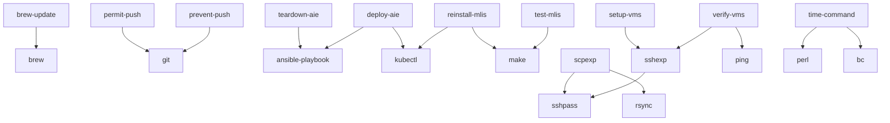

# HPE Toolkit
A set of tools I use at my job at HPE

## Tools Explanation

### `brew-update`

A 0-argument script to update the packages I have installed with `brew`.

<details open><summary>Usage</summary>

```sh
> brew-update
==> Updating Homebrew...
Updated 2 taps (homebrew/core and homebrew/cask).
==> New Formulae
...
```

</details>

### `deploy-aie`

A 0-argument script to deploy AIE with the configuration currently configured in my ezDeployer configuration variables.

<details open><summary>Usage</summary>

```sh
> deploy-aie
...
```

</details>

### `permit-push`

A 1-argument script to allow a git repository to push to a remote. Frequently used after `prevent-push`.

<details open><summary>Usage</summary>

```sh
> permit-push upstream
```

</details>

### `prevent-push`

A 1-argument script to prevent a git repository from pushing to a remote. Used when setting up remote git repositories.

<details open><summary>Usage</summary>

```sh
> prevent-push upstream
```

</details>

### `reinstall-mlis`

A 0-argument script to reinstall MLIS from the current MLIS state.

<details open><summary>Usage</summary>

```sh
> reinstall-mlis
```

</details>

### `scpexp`

A 2-argument script to transfer a file between two machines - local to remote, remote to local, or remote to remote. Any remote servers must have `rsync` installed on them prior to using this tool.

<details open><summary>Usage</summary>

```sh
> scpexp ./my-file kelleyt@10.227.212.49:~/my-file
```

</details>

### `setup-vms`

A 0-argument script to set up VMs I have been assigned in HPE's data center. The script installs `rsync` (useful for `scpexp`), runs `dnf upgrade` to update the host's packages, and reboots the vm.

<details open><summary>Usage</summary>

```sh
> setup-vms
```

</details>

### `sshexp`

A 1- or 2-argument script to open a shell on a remote machine (1-argument variant) or run a command on a remote machine (2-argument variant).

<details open><summary>Usage</summary>

```sh
> sshexp 10.227.212.49 "sudo dnf install -y rsync"
```

```sh
> sshexp 10.227.212.49
```

</details>

### `teardown-aie`

A 0-argument script to uninstall AIE with the configuration currently configured in my ezDeployer configuration variables.

<details open><summary>Usage</summary>

```sh
> teardown-aie
```

</details>

### `test-mlis`

A 0-argument script that tests the current version of MLIS on my machine against the current tests. Requires a running version of AIE.

<details open><summary>Usage</summary>

```sh
> test-mlis
```

</details>

### `time-command`

A 1-argument script that takes a zsh-interpretable string that is a script of commands and times how long the script takes to run in seconds.

<details open><summary>Usage</summary>

```sh
> time-command "sleep 1 ; sleep 1"
Command completed in 2.057 seconds.
```

</details>

### `verify-vms`

A 0-argument command that confirms that all VMs allocated to me are available via ICMP-ping and ssh.

<details open><summary>Usage</summary>

```sh
> verify-vms
Warning: Permanently added '10.227.210.149' (ED25519) to the list of known hosts.
Warning: Permanently added '10.227.210.150' (ED25519) to the list of known hosts.
...
```

</details>

### `enable/disable-nonsys-go`

A 0-argument script to enable or disable the system go install.

<details open><summary>Usage</summary>

```sh
> go version
go version go1.25.3 darwin/amd64
> enable-nonsys-go 
> go version
go version go1.24.9 darwin/amd64
> disable-nonsys-go 
> go version
go version go1.25.3 darwin/amd64
```

</details>

### `setup-socks5`

A 1-argument script to setup a socks5 proxy to a specific host.

<details open><summary>Usage</summary>

```sh
> setup-socks5 $ip-address...
```

</details>

<details open><summary><h2>Dependency Flowchart</h2></summary>



</details>
